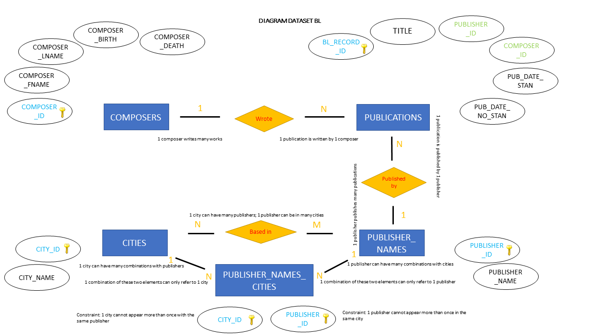

# [Data Modelling](https://github.com/lcavorsi/BL_SoundArchive_DataModelling)
Modelling, creating and querying a database for a British Library - Sound Archive collection  
(Part of PGCert in 'Applied Data Science', Birkbeck University)

## Overview
The assignment given at the end of the module on relational databases was divided in two steps: 
1) Creating a database in SQLite3 by using the programme's command line; populating it with values; querying it. 
2) Creating a similar, simplified, database with SQLite3 through Python, populating it and running some queries.

In the main folder the folliwing files have been made available: 
- excel file with metadata (sample of original)
- csv file with same metadata, for upload of values into database via Python
- image of the data model
- database created (SoundArchiveDatbase)
- .txt file with a list of queries run on the SQLite3 command line
- Python script to create, populate, query the database

## Technology used
- SQLite3
- Python

## Process
The starting point for this project was an Excel file with metadata describing a classical music collection held at the BL Sound Archive. I conceptually split the data in four different tables and noted down the relationships between them. In one case, the n:m relationship between two tables was resolved by creating a fifth table (a join table) featuring a composite primary key (see Table PUBLICATION_NAMES_CITIES).  
The data model is shown in the diagram below (primary keys in blue; foreign keys in green)

## Commands 
Below is the list of commands used to create the 5 tables of the database. The values have been populated both manually (via the INSERT function) and automatically (by uploading values from csv files via the .import command).

CREATE TABLE COMPOSERS   
(COMPOSER_ID integer primary key,  
COMPOSER_FNAME varchar(24),  
COMPOSER_LNAME varchar (40),  
COMPOSER_BIRTH integer,  
COMPOSER_DEATH integer);

CREATE TABLE PUBLICATIONS  
(BL_RECORD_ID integer primary key, 
TITLE text,  
PUBLISHER_ID integer REFERENCES PUBLISHER_NAMES(PUBLISHER_ID), 
COMPOSER_ID integer REFERENCES COMPOSERS(COMPOSER_ID), 
PUB_DATE_STAN integer,  
PUB_DATE_NO_STAN integer);

CREATE TABLE CITIES  
(CITY_ID integer primary key,  
CITY_NAME varchar(24) NOT NULL);

CREATE TABLE PUBLISHER_NAMES 
(PUBLISHER_ID integer primary key,  
PUBLISHER_NAME varchar(40) NOT NULL);

CREATE TABLE PUBLISHER_NAMES_CITIES  
(CITY_ID integer NOT NULL REFERENCES CITIES(CITY_ID), 
PUBLISHER_ID integer NOT NULL REFERENCES PUBLISHER_NAMES(PUBLISHER_ID),  
PRIMARY KEY (CITY_ID, PUBLISHER_ID));

